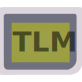
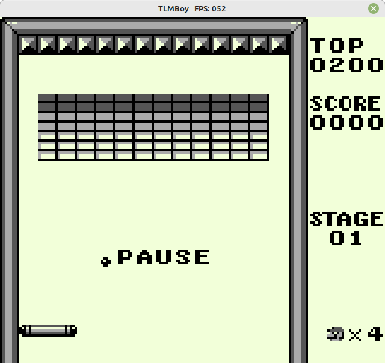
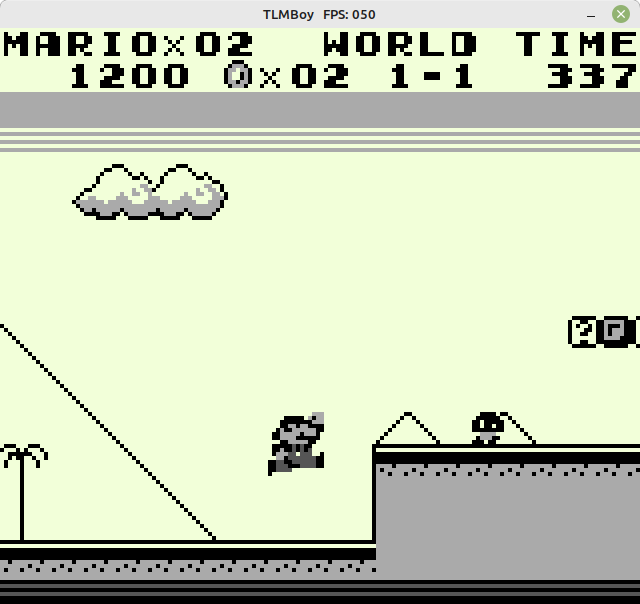
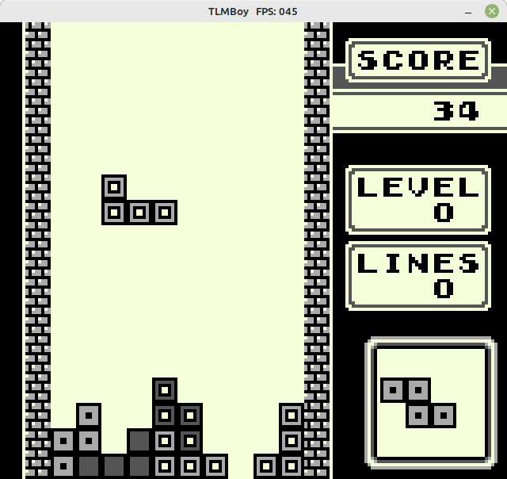
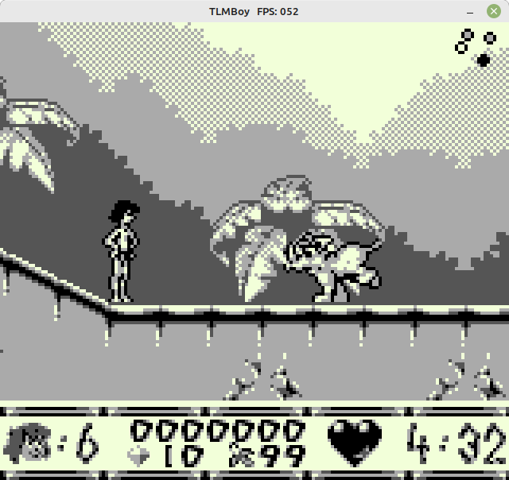

[](https://www.codacy.com/gh/not-chciken/TLMBoy/dashboard?utm_source=github.com\&utm_medium=referral\&utm_content=not-chciken/TLMBoy\&utm_campaign=Badge_Coverage)
[](https://www.codacy.com/gh/not-chciken/TLMBoy/dashboard?utm_source=github.com\&utm_medium=referral\&utm_content=not-chciken/TLMBoy\&utm_campaign=Badge_Grade)


# TLMBoy <br>

A Game Boy Simulator written in C++/SystemC TLM-2.0.

## Building

Use the following commands to build the TLMBoy:

```bash
cd TLMBoy
mkdir build
cd build
cmake tlmboy ..
cmake --build . --target tlmboy --config Release
```

Dependencies:

* [SystemC 2.3.3](https://github.com/accellera-official/systemc)
* [SDL2](https://github.com/libsdl-org/SDL)
* For tests: [googletest](https://github.com/google/googletest)

## Screenshots
Alleyway | Super Mario Land
:-------------------------:|:-------------------------:
 |  

Tetris | The Jungle Book
:-------------------------:|:-------------------------:
 |  


# Controls

| Keyboard  | Game Boy  |
|-----------|-----------|
| ←,↑,→,↓   | ←,↑,→,↓   |
| A         | A         |
| S         | B         |
| O         | Select    |
| P         | Start     |

Utilities:
| Keyboard  | Description                   |
|-----------|-------------------------------|
| 1         | Hold to not render background |
| 2         | Hold to not render sprites    |
| 3         | Hold to not render window     |

## Command Line Arguments

* `--boot-rom-path=X`: Specifies the path `X` of the boot ROM. Points to "../roms/DMG\_ROM.bin" by default.
* `--fps-cap=X`: Limits the maximum frames per second to `X`. Defaults to the Game Boy's default frame rate of 60 fps.
* `--headless`: Run the TLMBoy without any graphical output. This is useful for CI environments.
* `--max-cycles=X`: Only execute a maximum number of `X` clock (not machine!) cycles.
* `--rom-path=X`: Specifies the ROM/game `X` that shall be executed.
* `--single-step`: Prints the CPU state before the execution pf each instruction.
* `--symbol-file`: Traces accesses to the ROM and dumps a symbol file (trace.sym) on exit.
* `--wait-for-gdb`: Wait for a GDB remote connection on port 1337.

## Documentation

* [Overview](https://www.chciken.com/tlmboy/2022/02/02/gameboy-systemc.html)
* [GDB Remote Serial Protocol](https://www.chciken.com/tlmboy/2022/04/03/gdb-z80.html)

## TODO

* Show full tile map in window (currently only the lower tile map is shown)
* Implement the sound processor
* Complete instructions (stop)
* BankSwitchMemory: Use seperate functions for loading of the boot ROM and the game.
* BankSwitchMemory: Implement enable/disable RAM
* BankSwitchMemory: Implement all MBC
* Use native c++ implementation for ranges once available (maybe with c++23)
* Fix bank size of ram
* Checkpointing system
