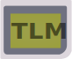

[](https://www.codacy.com/gh/not-chciken/TLMBoy/dashboard?utm_source=github.com\&utm_medium=referral\&utm_content=not-chciken/TLMBoy\&utm_campaign=Badge_Coverage)
[](https://www.codacy.com/gh/not-chciken/TLMBoy/dashboard?utm_source=github.com\&utm_medium=referral\&utm_content=not-chciken/TLMBoy\&utm_campaign=Badge_Grade)


# TLMBoy <br>

A Game Boy Simulator written in C++/SystemC TLM-2.0.

## Building

Use the following commands to build the TLMBoy:

```bash
cd TLMBoy
mkdir build
cd build
cmake tlmboy ..
cmake --build . --target tlmboy --config Release
```

Dependencies:

* [SystemC 2.3.3](https://github.com/accellera-official/systemc)
* [SDL2](https://github.com/libsdl-org/SDL)
* For tests: [googletest](https://github.com/google/googletest)

## Usage

After building TLMBoy, emulating a game is a simple as:
```bash
cd build
./tlmboy -r <PATH_TO_GAME_ROM>
```

Currently, the homebrew game [FlappyBoy](https://github.com/bitnenfer/flappy-boy-asm.git) is included as an example.
The example can be launched with:
```bash
cd build
./tlmboy -r ../roms/flappyboy.gb
```

## Command Line Arguments

* `--boot-rom-path=X`: Specifies the path `X` of the boot ROM. Points to "../roms/DMG\_ROM.bin" by default.
* `--color-palette=X`: Color palette hex string with four RGB colors from bright to dark. Default: f2ffd9aaaaaa555555000000.
* `--fps-cap=X`: Limits the maximum frames per second to `X`. Defaults to the Game Boy's default frame rate of 60 fps.
* `--headless`: Run the TLMBoy without any graphical output. This is useful for CI environments.
* `--max-cycles=X`: Only execute a maximum number of `X` clock (not machine!) cycles.
* `--resolution-scaling=X`: Scaling of the game window's resolution. A value of 1 corresponds to the original resolution of 160x144. Default 4.
* `--rom-path=X`: Specifies the ROM/game `X` that shall be executed.
* `--single-step`: Prints the CPU state before the execution pf each instruction.
* `--symbol-file`: Traces accesses to the ROM and dumps a symbol file (trace.sym) on exit. The file can be used in debuggers and disassemblers.
* `--wait-for-gdb`: Wait for a GDB remote connection on port 1337.

## Screenshots
Alleyway | Super Mario Land
:-------------------------:|:-------------------------:
 |  

Tetris | The Jungle Book
:-------------------------:|:-------------------------:
 |  


# Controls

| Keyboard  | Game Boy  |
|-----------|-----------|
| ←,↑,→,↓   | ←,↑,→,↓   |
| A         | A         |
| S         | B         |
| O         | Select    |
| P         | Start     |

Utilities:
| Keyboard  | Description                   |
|-----------|-------------------------------|
| 1         | Hold to not render background |
| 2         | Hold to not render sprites    |
| 3         | Hold to not render window     |
| SPACE     | Turbo mode (3x speed)         |


## Documentation

* [Overview](https://www.chciken.com/tlmboy/2022/02/02/gameboy-systemc.html)
* [GDB Remote Serial Protocol](https://www.chciken.com/tlmboy/2022/04/03/gdb-z80.html)
